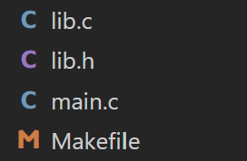
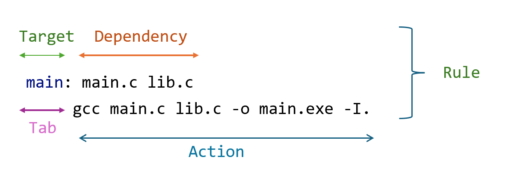
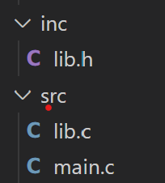
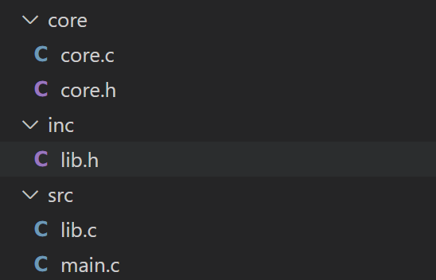

Tài liệu tham khảo: 
- https://www.gnu.org/software/make/manual/make.html#Rule-Syntax 
- https://github.com/Leminuos/makefile/blob/master/Makefile

⚠️ Tất cả kiến thức ở đây đều là kiến thức mình tìm hiểu được nhờ google và học hỏi từ đồng nghiệp 🎶
Nếu sai sót == true ? " Đóng góp " : " Khen ngợi "


# MAKEFILE CƠ BẢN - ĐỖ VĂN NGỌC 
- Nội dung: 12 Phần
- Mục tiêu: có thể viết được makefile để build cho các dự án vừa và nhỏ

-------------------------------------------------------------------------------------------------------------------
# PHẦN 1: GIỚI THIỆU VỀ MAKEFILE
- Bản chất makefile dùng để thực thi các command
- Khi dùng makefile để rebuild một dự án, nó sẽ chỉ build lại những file đã thay đổi giúp giảm thời gian rebuild
# PHẦN 2: CÁCH BUILD FILE .c BẰNG GCC

## 2.1 Có 1 file main.c duy nhất
Có chương trình như  sau:

```cpp
#include <stdio.h>
int main(){
    printf("Hello world");
    return 0;
}
```

Cách build với gcc
```cpp
gcc main.c -o main.exe
```
Trong đó:
- "-o": output
- "main.c": file cần biên dịch
- "main.exe": file output 
## 2.2 Có nhiều file .c, .h link với nhau
#### Cấu trúc thư mục hiện tại như sau

#### Cách 1: 
B1: Từng file.c build ra từng file .o
B2: Link các file .o đó lại với nhau
```cpp
--> gcc -c main.c -o main.o           -> Build ra file main.o
--> gcc -c lib.c -o lib.o             -> Build ra file lib.o
--> gcc main.o lib.o -o main.exe      -> Build ra file main.exe là file để chạy của chương trình
```
Trong đó 
- "-c": tạo ra các file object
- "-o": tạo ra file output

#### Cách 2:
Đơn giản hơn, chúng ta gộp các lệnh trên bằng việc dùng "-I.": gcc sẽ thực hiện tìm kiếm trong thư mục hiện tại "." để thêm các file header khác
```cpp
--> gcc main.c lib.c -o main.exe -I.  -> Build ra file main.exe là file chạy của chương trình
```
--> Nhận thấy rằng cả hai cách trên đều không clean với các dự án lơn
--> Make file chính là để dùng cho trường hợp như vậy

# PHẦN 3: RULE CỦA MAKEFILE CƠ BẢN

- Rule: các rule cần thực hiện khi compile
- Dependency: là các file cần thiết để tạo ra target
- Action: là câu lệnh compile để tạo ra Target từ Dependency. Action được thụt lùi vào 1 Tab (phím tab trên bàn phím) so với Target
- Target: là file đích, nghĩa là file được hình thành sau khi quá trình make được thực hiện.

# PHẦN 4: BIẾN TRONG MAKEFILE
Biến trong makefile được khởi tạo như sau
```cpp
NAME = VALUE
```
Biến được call bằng
```cpp
${NAME} hoặc $(NAME)
```

# PHẦN 5: TẠO MỘT MAKEFILE CƠ BẢN
```cpp
CC=gcc
CFLAGS=-I.
main: main.c lib.c
     $(CC) main.c lib.c -o main.exe -I.
```
--> Đoạn makefile trên sau khi chạy câu lệnh make main: thì sẽ cho ra main.exe: là file chạy của chương trình
# PHẦN 6: MỘT VÀI KÍ TỰ TRONG MAKEFILE CẦN NẮM RÕ
```cpp
%.o :Một pattern của một tệp đối tượng có phần mở rộng .o
%.c :Một pattern của một tệp đối tượng có phần mở rộng .c
$@ là thành phần trong tập tin bên trái dấu :
$< là thành phần đàu tiên trong danh sách của dependency 
```
Khi đó ta có thể viết một đoạn makefile để build project của chúng ta như sau
```cpp
CC=gcc
CFLAGS=-I.
DEPS = lib.h

%.o: %.c $(DEPS)
	$(CC) -c -o $@ $< $(CFLAGS)

main: main.o lib.o 
	gcc main.o lib.o -o main.exe $(DEPS)
```
main: main.c lib.c
    gcc main.c lib.c -o main.exe -I.


# PHẦN 7: RULE TRONG MAKEFILE 
Bởi vì rule rất quan trọng trong make, do đó có rất nhiều rule khác nhau
- Explicit rules
- Pattern rules
- Implicit rules
- Static pattern rules
- Suffix rules

# PHẦN 8: WILDCARDS
Phần trước chúng ta đã biết về một số kí tự như *.c, *.o
-> bản chất chúng được gọi là WILDCARDS: đại diện cho một đối tượng có phần mở rộng
# PHẦN 9: PHONY TARGET

Sẽ ra sao nếu các target của chúng ta trùng với tên file, ví dụ ta có lệnh:
```cpp
clean:
	rm -f *.o *.exe
```
Và ta có file "clean" trùng với target ở trên thì điều gì sẽ xảy ra
Kết quả:
```cpp
make: 'clean' is up to date.
```
--> Để tránh điều đó, chúng ta sửa thành 
```cpp
.PHONY: clean
make: 'clean' is up to date.
```
Một số chuẩn phony hay dùng:
```cpp
| Target	| Function                                                         |
-----------------------------------------------------------------------------------|
| all	        | Thực hiện build toàn bộ                                          |
| install	| Tạo bản cài đặt của ứng dụng từ việc compile binary              |
| clean	        | Xóa binary file được tạo từ source                               |
| distclean 	| Xóa tất cả các file được tạo ra mà ko nằm trong source chính     |
| TAGS	        | Tạo bảng tag để editor dùng                                      |
| info	        | Tạo GNU info file từ textinfo source                             |
| check	        | Chạy bất kỳ test nào tương ứng với chương trình                  |
```
# PHẦN 10: AUTOMATIC VARIABLE
```cpp
$@	|  Tên tệp đại diện cho target
$%	|  Phần tử tên tệp của đặc tả thành viên lưu trữ.
$<	|  Tên của prerequisite đầu tiên.
$?	|  Tên của tất cả các prerequisite mới hơn target, được phân cách bằng dấu cách.
$^	|  Tên tệp của tất cả các prerequisite, được phân cách bằng dấu cách.
$+	|  Tương tự như $^, đây là tên của tất cả các prerequisite được phân tách bằng dấu cách, ngoại trừ $+ bao gồm các bản sao.
$*	|  $ * Phần gốc của tên tệp đích. Phần gốc thường là một tên tệp không có hậu tố của nó.
```
# PHẦN 11: VPATH VÀ CFLAGS TRONG MAKEFILE
Từ trước tới thời điểm hiện tại, các file .c .h chúng ta đang để ở folder root nên việc thao tác với nó rất đơn giản,
sẽ ra sao nếu chúng ta để các file.c trong folder src và các file.h để trong folder inc

Giải pháp:
```c
CFLAGS=-I inc
VPATH = src
```
Khi để như này thì lúc đầu nó sẽ chủ động tìm trong thư mục root(.) trước, nếu không có các file .c,.h cần tìm thì nó sẽ tìm trong các folder mình định nghĩa ở trên
Khi này thì makefile sẽ tự động tìm các file .c và file.h trong 2 folder nói trên và sẽ không xảy ra lỗi, đây chính là sức mạnh của CFLAGS và VPATH
# PHẦN 12: FOREACH TRONG MAKEFILE
Phần trước chúng ta đã biết làm sao để makefile hiểu được các file.c hay file.h trong 1 folder bất kì đúng không?
Vậy có một câu hỏi đặt ra là nếu có nhiều folder chứa file.c hoặc nhiều folder chứ file .h thì làm thế nào?
Đây chính là lúc chúng ta cần đến foreach



```cpp
$(foreach var, list, text)
```
Trong đó:

- var: Biến tạm dùng để lưu trữ mỗi phần tử trong list trong mỗi vòng lặp.
- list: Danh sách các phần tử mà bạn muốn lặp qua.
- text: Phần tử hoặc biểu thức cần thực hiện với mỗi phần tử trong list.

Kết quả:
```cpp
CC=gcc

INC_DIR := ./inc ./core
SRC_DIR := ./src ./core

CFLAGS= $(foreach INC_DIR, $(INC_DIR), -I$(INC_DIR))

VPATH = $(foreach SRC_DIR, $(SRC_DIR), $(SRC_DIR))

%.o: %.c
	$(CC) -c $(CFLAGS) $< -o $@

all: main.o lib.o core.o
	gcc main.o lib.o core.o -o main.exe

clean:
	rm -f *.o *.exe

.PHONY: clean all
```
